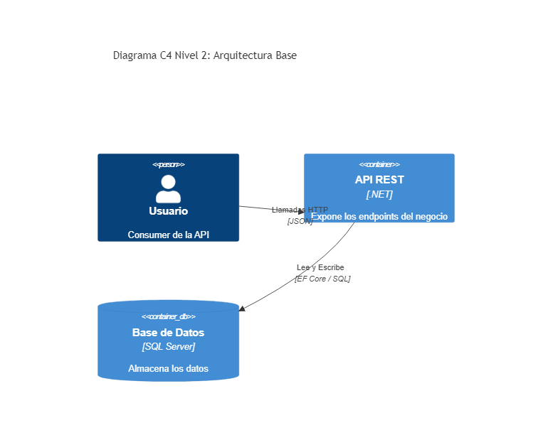

# 00. Base Architecture

## Resumen Ejecutivo
Representa la arquitectura base tradicional (ej. N-Capas o Clean Architecture simplificada). Sirve como punto de partida sin patrones avanzados, ideal para entender los flujos básicos antes de añadir complejidad estructural.

## Diagrama C4 Nivel 2 (Contenedores)

## Conexión con el Objetivo (99. Target Architecture)
Este bloque es el cimiento de la Arquitectura Target (Arquitectura de Referencia). A medida que escalemos, reemplazaremos este acoplamiento directo entre API y Base de datos por colas de mensajería, CQRS y orquestadores, acercándonos al 99.

## Tip de .NET 9
En .NET 9, el soporte integrado de OpenAPI y la herramienta `Microsoft.AspNetCore.OpenApi` reemplazan la necesidad de Swashbuckle, generando especificaciones nativas mucho más eficientes por defecto.
